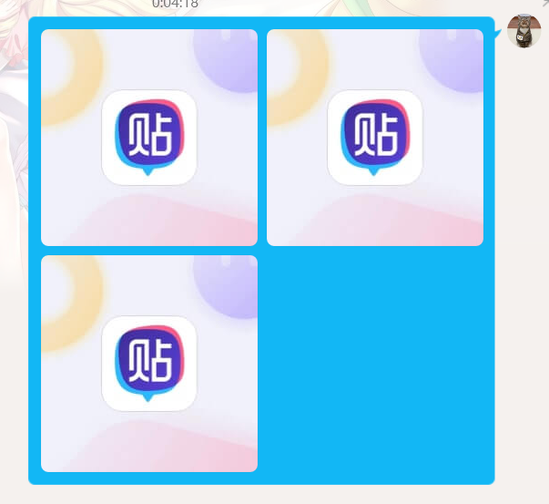

# nonebot-plugin-imagemaster
基于cv2的轻量化在线图片编辑插件，提供多种图像处理功能，包括色彩调整、裁剪、表情包和特殊效果等

## 介绍

简简单单修个图啦~

## 安装
使用pip进行安装

``pip install nonebot-plugin-imagemaster``
## 使用

| 指令       | 描述                   | 用法              |
| ---------- | ---------------------- | ----------------- |
| 图片处理   | 应用不同的图像处理滤镜 | 发送 `图片处理`   |
| 图像裁剪   | 对图片进行裁剪         | 发送 `图像裁剪`   |
| 图像拼接   | 将多张图片拼接成一张   | 发送 `图像拼接`   |
| 表情包制作 | 制作自定义文字的表情包 | 发送 `表情包制作` |

### 图片处理

1. 发送 `图片处理`
2. 发送图片
3. 等待机器人发送进一步的指令提示

### 图像裁剪

1. 发送 `图像裁剪`
2. 发送图片
3. 等待机器人发送进一步的指令提示

### 图像拼接

1. 发送``图像拼接`

2. 根据指令发送图片数量

3. **重点！！！** 需要**一次性**发送所有张图片，安卓端选择好一定数量的图片后发送并不是**一次性**发送，需要把所有图像**合并为一条消息**才能发送出去

   (1). pc端

   ​		具体地，在电脑端的操作为把所有图片都放到消息框里发送，较为容易

   

   ​		此时发送即为**合并成一条消息**发送

   

   ​	(2). 安卓端

   ​			在安卓端的操作较复杂一点，并且必须为**非简洁模式**才能合并多张图片为一条消息，简洁模式无法实现

   ​			首先在文本框里**打入一个空格**，后再选择图片

   ​	

   ​			然后发送即可实现合并

   ​	

   如果发生数字输入错误，可以发送``停止拼接``以停止当前活动

   ### 表情包

   1. 发送 `表情包制作`
   2. 发送图片
   3. 等待机器人发送进一步的指令提示

## 画饼
未来将添加文字识别、~~图像拼接~~等功能

## 贡献
欢迎提交Pull Request或报告Issues。

## 许可
[MIT License](LICENSE)

## 致谢
特此感谢本学期计算机视觉课程的教授，他的专业指导和启发性教学为本项目提供了宝贵的理论支持和灵感。作者在课程中学习到的知识和技能，对于本项目的成功实现起到了关键性作用。我们对他的辛勤付出和深厚的专业知识表示最深的敬意和感激。

